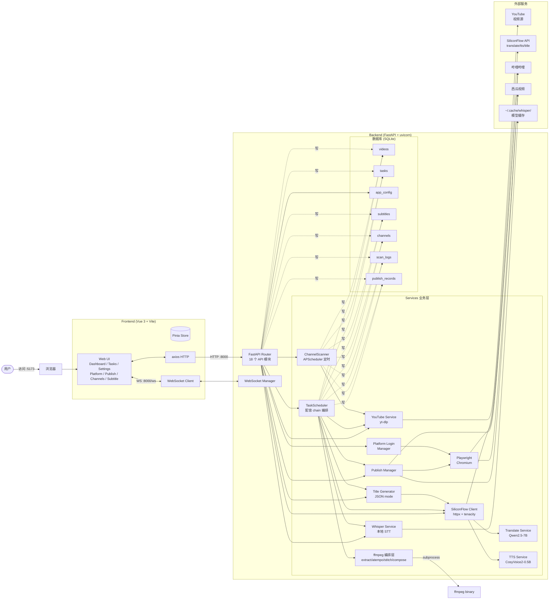
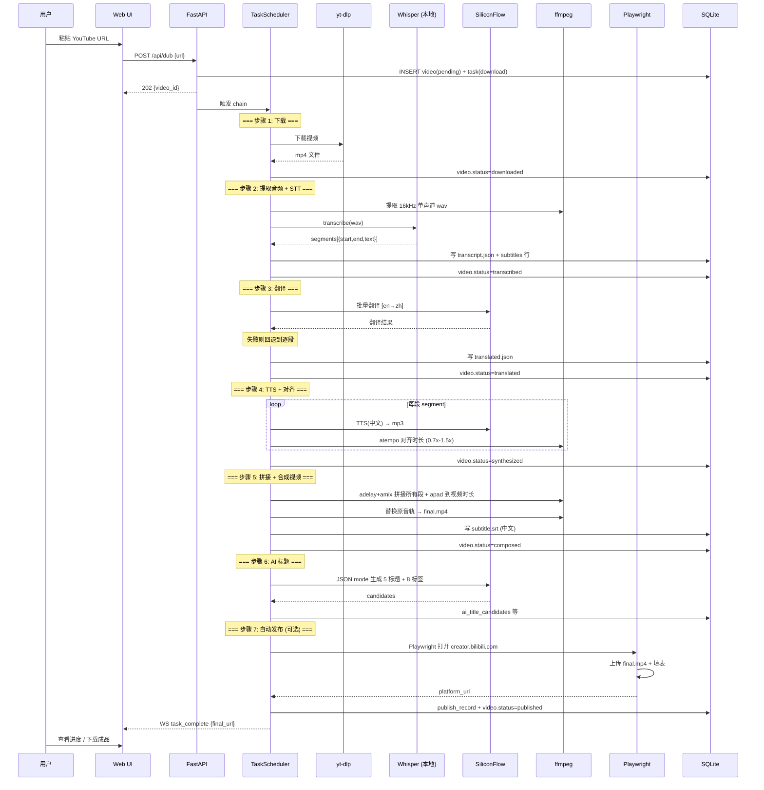
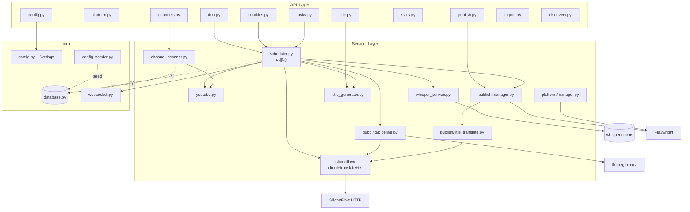
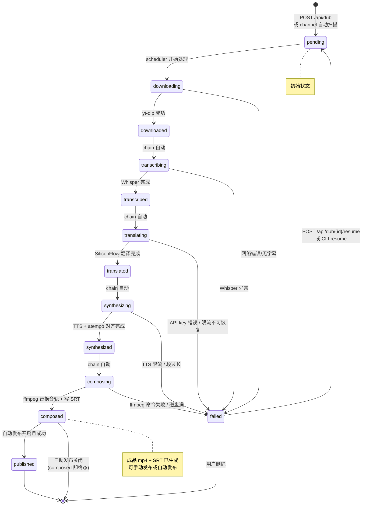

# 架构文档

> You2Bili v2.0 — YouTube 视频中文配音 + 自动发布系统的整体架构、数据流、模块依赖、状态机。

---

## 1. 系统架构总览

---

## 2. 核心数据流 — 从 URL 到发布的完整链路

---

## 3. 模块依赖图

---

## 4. Video.status 状态机（全流转图）

---

## 5. 关键设计决策

| ID | 决策 | 原因 |
|----|------|------|
| D-01 | API Key 直接放 `.env`，不入 DB | 简化部署；用户自用工具无多用户风险 |
| D-05 (pivot) | 放弃 BGM 保留，整轨替换 | Demucs 资源占用大、人声分离质量不稳定 |
| D-09 | atempo + pad/trim 时间对齐，调速 0.7-1.5x | 兼顾自然度和时长精度 |
| D-13/D-14 | 状态机去除 separating/mixed | 对应 D-05 决策 |
| D-17 (pivot) | STT 改用本地 Whisper | SiliconFlow SenseVoiceSmall 不返回 segment 时间戳 |
| Phase 4 Rule 1 | 翻译批量失败回退到逐段单独请求 | Qwen2.5-7B 常忽略 `[ID:N]` 格式 |
| Phase 6 | 哔哩哔哩走 HTTP QR API，西瓜走 Playwright | 哔哩官方 API 稳定；西瓜无公开 QR API |
| Phase 7 | Playwright headed 模式 | 模拟真实浏览器防风控；headless 易被识别 |
| Phase 8 | SiliconFlow Chat JSON mode | 一次调用拿标题+标签+摘要，比纯文本解析更稳 |
| Phase 9 | APScheduler 内存 jobstore | FastAPI 重启从 DB 重建；不依赖外部持久化 |

---

## 6. 并发与限流策略

| 资源 | 限制 | 实现 |
|------|------|------|
| TTS 并发 | 3 个 segment 并发 | `asyncio.Semaphore(3)` 在 `services/dubbing/pipeline.py` |
| 频道扫描 | 3 个频道并行 | `asyncio.Semaphore(scan_max_concurrent)` 在 `channel_scanner.py` |
| SiliconFlow HTTP 重试 | 最多 3 次 + 指数退避（2-30s） | `tenacity stop_after_attempt(3) + wait_exponential` |
| yt-dlp 进度推送 | 每 ~1s 节流 | yt-dlp progress_hook + asyncio.create_task 异步推 |
| WebSocket 广播 | 无节流（信任本地用户量） | `manager.broadcast(msg)` 单一 fan-out |

---

## 7. 文件 → 模块映射

| 模块 | 主文件 | 关键类/函数 |
|------|--------|-------------|
| 任务调度核心 | `app/services/scheduler.py` | `TaskScheduler`、`_handle_*` chain |
| YouTube 下载 | `app/services/youtube.py` | `YoutubeService.get_video_info / download_video / get_channel_videos` |
| Whisper STT | `app/services/whisper_service.py` | `WhisperService.transcribe` |
| SiliconFlow 客户端 | `app/services/siliconflow/client.py` | `SiliconFlowClient.chat / tts / translate_batch` |
| 翻译 | `app/services/siliconflow/translate.py` | `translate_segments`（批量+逐段回退） |
| TTS | `app/services/siliconflow/tts.py` | `synthesize_segment` |
| ffmpeg 编排 | `app/services/dubbing/{pipeline,ffmpeg,alignment,stitcher,composer,paths}.py` | 6 步流水线 |
| AI 标题 | `app/services/title_generator.py` | `generate_title_candidates` (JSON mode + 文本回退) |
| 平台登录 | `app/services/platform/{base,manager,bilibili,ixigua}.py` | `LoginManager` 单例 |
| 平台发布 | `app/services/publish/{base,manager,bilibili,ixigua,title_translate}.py` | `PublishManager` |
| 频道扫描 | `app/services/channel_scanner.py` | `ChannelScanner` + APScheduler |
| 配置 | `app/services/config_seeder.py` + `app/core/config.py` | `DEFAULT_CONFIGS` dict + Pydantic Settings |
| WebSocket | `app/core/websocket.py` | `ConnectionManager.broadcast` |

---

*本文档对应 Phase 10 (v2.0.10) · 最后更新：2026-06-22*
