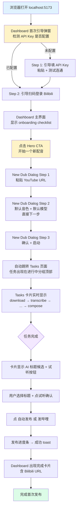

# you2bili v2.1 UX 重设计方案 (Phase 11 交付)

> **状态**: DRAFT — Phase 12 实施依据
> **作者**: UX Researcher (Phase 11)
> **日期**: 2026-06-23
> **依据**: v2.0 Phase 5/6/7/8/9/10 已交付源码 + 用户反馈「界面很丑、很不人性化」
> **范围**: 仅前端重构。后端 API 原则不动，只增不改。

---

## §1. 现状盘点 (8 个页面)

> 来源：阅读 `frontend/src/views/*.vue` + `MainLayout.vue` + `router/index.ts`

### 1.1 MainLayout（侧边栏布局）
- **做什么**：深色侧边栏 (#304156) + 顶栏面包屑 + WS 连接状态徽章。
- **关键交互**：侧边栏可折叠（64px ↔ 220px），7 个一级菜单（仪表盘/视频管理/任务队列/频道管理/平台登录/发布历史/系统设置）。
- **痛点**（来自 `MainLayout.vue` 第 13-21 行）：
  1. 7 个一级菜单对新手是认知负担。`/videos`、`/tasks`、`/channels` 三个其实都是「任务/视频」相关，但被并列展示。
  2. 侧边栏无视觉分组（没有「主流程 / 配置 / 历史」之类的分隔）。
  3. 顶栏除了面包屑 + WS 徽章外空白浪费，没有放「快速新建」按钮。
- **改造方向**：导航降到 3 项（首页 / 任务 / 设置）。其他通过首页卡片或行内入口进入。

### 1.2 DashboardView（仪表盘）
- **做什么**：4 张统计卡片（今日任务数 / 成功率 / 平均耗时 / API 调用估算） + 最近 5 个任务卡片 + 失败任务表格 + 平台账号状态行（`DashboardView.vue` 第 122-280 行）。
- **关键交互**：右上角「刷新」+「新建配音任务」按钮 → DubCreateDialog。
- **痛点**：
  1. 顶部 4 张统计卡是「运营仪表盘」思维，对个人搬运者意义有限（成功率/平均耗时其实从任务列表就能感知）。新手第一眼看到一堆数字会迷茫。
  2. 「新建配音任务」按钮混在 header 右侧两个按钮之一，不够显眼。核心动作（搬运一个视频）没有视觉优先级。
  3. 「最近任务」卡片是缩略卡片，没有缩略图，看不出是哪个视频（`DashboardView.vue` 第 179-214 行，task-card 只有 title + tag + progress）。
  4. 平台登录状态卡在底部，「未登录」时只有一个红色 tag 文字，没有引导动作（`DashboardView.vue` 第 233-240 行）。
  5. 失败任务表格在底部，新手不会注意到要处理。
- **改造方向**：Dashboard 顶部巨型 hero CTA「开始一个新配音」，左下「当前进行中」实时进度，右下「平台账号状态」(未登录则强引导)，中部「最近完成」带缩略图卡片，底部「新手 onboarding checklist」。

### 1.3 VideosView（视频管理）
- **做什么**：表格列出所有视频，含 YouTube 发现弹窗（关键词/频道扫描）、手动添加 URL、下载/配音/上传按钮（`VideosView.vue`）。
- **关键交互**：toolbar 上「YouTube 发现」+「手动添加」两个按钮；表格行内根据 status 显示不同操作按钮（下载/字幕/配音/上传B站/上传西瓜/删除）。
- **痛点**：
  1. 「YouTube 发现」和「手动添加 URL」是两个分散入口，与 Dashboard 上的「新建配音任务」(DubCreateDialog) 功能重叠 — 用户不知道用哪个。
  2. 表格行的操作按钮最多有 6 个（下载/字幕/配音/下载配音/上传B站/上传西瓜/删除），视觉拥挤。
  3. 状态标签枚举有 13 种（`VideosView.vue` 第 370-388 行），新手看不懂「transcribed」「dubbed」等技术词汇。
  4. 「YouTube 发现」弹窗里嵌套折叠面板做筛选条件，是开发者思路不是用户思路。
- **改造方向**：废弃 VideosView 作为一级页面，把「发现」功能合并到 Dashboard 的 New Dub Dialog（Step 1 支持 URL 粘贴 + 关键词搜索两种模式）。视频列表合并到 Tasks 视图（一个视频 = 一组任务）。

### 1.4 TasksView（任务队列）
- **做什么**：表格列出所有 dubbing 任务，支持状态/类型/来源/日期筛选、批量暂停/恢复/重试/删除、CSV/JSON 导出、行内试听 popover、重新执行、续跑、AI 标题、自动发布、发哔哩、发西瓜（`TasksView.vue`）。
- **关键交互**：复杂筛选条 + 批量工具栏 + 表格行内最多 8 个操作按钮（试听/重试/续跑/重新执行/取消/字幕/AI标题/自动发布/发哔哩/发西瓜）。
- **痛点**：
  1. 表格列多达 9 列（选择/ID/视频/步骤/状态/进度/消息/创建时间/操作），1366×768 屏幕下操作列被压缩。
  2. 行内操作按钮根据 status 显示不同组合（`TasksView.vue` 第 464-585 行），新手看不出能做什么。
  3. 「步骤」列只显示当前一个步骤名（download/transcribe/translate/synthesize/compose），看不出全流程进度。
  4. 试听通过 popover 弹出 `<audio>` 元素（`TasksView.vue` 第 466-513 行），体验割裂。
- **改造方向**：废弃 el-table，改用 card list。每张卡片：缩略图 + 标题 + 横向 stepper（download→transcribe→translate→synthesize→compose→publish 6 个圆点）+ 当前步骤高亮 + 主要操作按钮。按状态分组（进行中 / 已完成 / 失败）手风琴折叠。

### 1.5 SubtitleEditorView（字幕编辑）
- **做什么**：双语并列表格（原文/中文），行内编辑中文（失焦自动保存），行内试听（跳到 segment.start），行内重译（调 SiliconFlow），顶部工具栏全部重译/导出 SRT/导出双语 SRT/保存全部（`SubtitleEditorView.vue`）。
- **关键交互**：el-table 5 列（#/时间/原文/中文/操作），编辑中文 input + 失焦保存。
- **痛点**：
  1. 表格是上下滚动的，看不到视频画面 — 用户编辑时无法对照画面验证。
  2. 「试听」按钮只播音频（`SubtitleEditorView.vue` 第 186-195 行），看不到画面同步。
  3. 顶部工具栏 4 个按钮一字排开，主次不分（重译全部 / 导出 / 导出双语 / 保存）。
  4. 编辑中文输入框是 `el-input type="textarea" :rows="2"`，表格行高被撑大，一屏只能看 5-6 行。
- **改造方向**：左右分屏。左侧视频播放器（点击字幕行 → 视频跳转 + 播放），右侧双语字幕滚动列表（更紧凑的单行编辑）。顶部操作栏分主次（保存 = primary，导出 = ghost）。

### 1.6 PlatformLoginView（平台登录）
- **做什么**：两栏（Bilibili / 西瓜）卡片，扫码登录全流程：idle → loading_qr → waiting_scan → scanned → success / expired / timeout / failed（`PlatformLoginView.vue`）。
- **关键交互**：每栏独立状态机；扫码图片 220×220；状态徽章实时变化。
- **痛点**：
  1. 是孤立一级页面，跟核心流程没有引导关联 — 用户首次进来不知道要先登录才能发布。
  2. 「说明 alert」一段长文字（`PlatformLoginView.vue` 第 297-304 行）解释扫码登录机制，新手不会读。
  3. 未登录态 `el-empty :image-size="60"` 太小，登录按钮 `type="primary"` 但与「检测登录态」并排，优先级弱（`PlatformLoginView.vue` 第 374-380 行）。
  4. 二维码区域没有倒计时提示，过期才知道要重扫。
- **改造方向**：Dashboard 右侧常驻「平台账号」卡片，未登录时强引导（红色感叹号 + 大「扫码登录」按钮）。点开后是 Modal/Drawer，而不是独立页面。已登录显示头像 + 用户名 + 绿色徽章。

### 1.7 SettingsView（系统设置）
- **做什么**：左侧 8 个 tab（SiliconFlow / Whisper / TTS / Translate / 高级 / 自动发布 / 平台管理 / AI 标题），每个 tab 内表单字段，保存全部按钮（`SettingsView.vue`）。
- **关键交互**：每个字段 blur/change 即保存，底部「保存全部」按钮兜底。
- **痛点**：
  1. 8 个 tab 一字排开（`SettingsView.vue` 第 195-286 行 tabs 计算属性），新手看到「Whisper/TTS/Translate/高级」直接劝退。
  2. 「平台管理」tab 其实只是个跳转链接到 /platform 页（`SettingsView.vue` 第 510-512 行），冗余。
  3. SiliconFlow API Key 是必填项（无 Key 任何功能都跑不起来），但藏在 tab 里，没有首次引导。
  4. 「自动发布」和「AI 标题」相关配置混在 Settings，但其实是业务策略，新手不会主动来 Settings 找。
- **改造方向**：8 tab → 3 大类（API 配置 / 配音参数 / 高级）。首次启动 if API Key empty → Dashboard 强制弹窗引导。把「自动发布」「AI 标题」配置挪到 Dashboard 的快速设置区。

### 1.8 ChannelsView（频道管理）+ PublishHistoryView（发布历史）
- **做什么**：Channels = 表格 + 添加/编辑/删除/扫描/日志抽屉；PublishHistory = 表格 + 重试/打开 URL。
- **痛点**：两个低频页面占了一级菜单位置，但 90% 时间用户不需要看。
- **改造方向**：Channels 合并到 Tasks 页面（顶部 Tab「任务 / 频道 / 发布历史」），从侧边栏消失。或者作为 Settings 子页面。

---

## §2. 用户旅程（首次发布最优路径）

> 角色：完全没接触过 you2bili 的新用户。
> 目标：从 `http://localhost:5173` 打开到「视频已发布到 Bilibili」。
> 预期：5 分钟内完成首次配音 + 发布（不含视频处理耗时，仅用户操作时间）。



**关键 UI 元素映射**：
- `B`：首次引导弹窗（新增，全屏 Modal）
- `E`：Dashboard onboarding checklist（新增）
- `F`：Dashboard Hero CTA 巨型按钮（重构）
- `G/H/I`：New Dub Dialog 3 步向导（重构 DubCreateDialog）
- `J/K`：Tasks 卡片列表（重构 TasksView）
- `M/N`：任务卡片 completed 态扩展（新增 AI 标题 inline + 试听 inline）
- `O`：行内发布按钮（保留）
- `Q`：Dashboard 完成卡片含平台 URL（新增）

---

## §3. 信息架构重构

### 3.1 一级导航从 7 个降到 3 个

| 旧导航（7 项） | 新导航（3 项） | 入口转移 |
|---------------|---------------|---------|
| 仪表盘 | **首页 (Dashboard)** | 主入口 |
| 视频管理 | 删除 | 合并到 Dashboard 的「最近视频」+ New Dub Dialog 的「关键词发现」 |
| 任务队列 | **任务 (Tasks)** | 主入口 |
| 频道管理 | Tasks 页面顶部 Tab | 「任务 / 频道 / 发布历史」3 个 Tab 切换 |
| 平台登录 | Dashboard 右侧卡片入口 | 点击卡片打开 Modal/Drawer |
| 发布历史 | Tasks 页面顶部 Tab | 同频道 |
| 系统设置 | **设置 (Settings)** | 主入口 |
| 字幕编辑 | 任务卡片行内入口 | `/tasks` → 点卡片 → 进入字幕编辑（隐藏路由） |

### 3.2 新导航树

```
/ (MainLayout)
├── /dashboard (首页)
│   ├── [Hero] 新建配音 → New Dub Dialog (Modal)
│   ├── [Left]  当前进行中任务列表（实时）
│   ├── [Right] 平台账号状态卡
│   │   ├── 点击 → Platform Login Modal (Drawer)
│   │   └── 点击 → 平台账号管理详情
│   ├── [Center] 最近完成视频卡片网格（含缩略图）
│   ├── [Bottom] 新手 onboarding checklist
│   └── [Bottom] 失败任务列表（折叠默认展开）
│
├── /tasks (任务)
│   ├── Tab 1: 任务列表（默认）
│   │   ├── 分组：进行中 / 已完成 / 失败（accordion）
│   │   ├── 任务卡片（点击展开详情 / 字幕编辑入口）
│   │   └── 子路由 /tasks/:videoId/subtitles（隐藏）
│   ├── Tab 2: 频道管理（原 ChannelsView）
│   └── Tab 3: 发布历史（原 PublishHistoryView）
│
└── /settings (设置)
    ├── Section 1: API 配置
    │   ├── SiliconFlow API Key（带测试按钮）
    │   └── 平台账号快捷入口
    ├── Section 2: 配音参数
    │   ├── TTS 音色 / 语速 / 音量
    │   ├── 翻译模型
    │   ├── 自动发布策略
    │   └── AI 标题策略
    └── Section 3: 高级
        ├── 下载目录 / 并发数
        └── atempo 边界
```

### 3.3 字幕编辑改为子路由（隐藏）

- 旧路由 `/videos/:videoId/subtitles` 保留兼容。
- 新入口：任务卡片点「字幕」按钮 → `router.push('/tasks/' + videoId + '/subtitles')`。
- 字幕编辑页改为全屏 layout（不显示侧边栏），返回按钮回到 Tasks。

---

## §4. 视觉规范

### 4.1 主色（避开 Element Plus 默认 blue #409EFF 的 generic 感）

| 角色 | Hex | 用途 |
|------|-----|------|
| Primary（主品牌色） | `#4F46E5` (indigo-600) | 主 CTA 按钮 / 选中态 / 链接 hover |
| Primary Hover | `#4338CA` (indigo-700) | 按钮 hover |
| Primary Light | `#EEF2FF` (indigo-50) | 选中行背景 / Hero CTA 容器背景 |
| Primary Disabled | `#C7D2FE` (indigo-200) | 禁用按钮 |

**Element Plus 主题变量覆盖**（`styles/element-overrides.scss`）：
```scss
:root {
  --el-color-primary: #4F46E5;
  --el-color-primary-light-3: #6366F1;
  --el-color-primary-light-5: #818CF8;
  --el-color-primary-light-7: #A5B4FC;
  --el-color-primary-light-9: #EEF2FF;
  --el-color-primary-dark-2: #4338CA;
}
```

### 4.2 中性色

| 角色 | Hex | 用途 |
|------|-----|------|
| Text Primary | `#111827` (gray-900) | 标题 / 正文 |
| Text Regular | `#4B5563` (gray-600) | 次要文字 |
| Text Secondary | `#9CA3AF` (gray-400) | 占位符 / 标签 |
| Border | `#E5E7EB` (gray-200) | 卡片边框 / 分隔线 |
| Background Page | `#F9FAFB` (gray-50) | 页面背景 |
| Background Card | `#FFFFFF` | 卡片背景 |
| Sidebar BG | `#1E293B` (slate-800) | 侧边栏（比旧 #304156 更现代） |

### 4.3 功能色（沿用 Element Plus 默认）

| 角色 | Hex | 用途 |
|------|-----|------|
| Success | `#10B981` (emerald-500) | 已登录 / 已完成 / 成功 toast |
| Warning | `#F59E0B` (amber-500) | 进行中 / 待操作 |
| Danger | `#EF4444` (red-500) | 失败 / 未登录 / 删除按钮 |
| Info | `#6B7280` (gray-500) | 待处理 / 中性 tag |

### 4.4 字体

```css
:root {
  --font-sans: 'PingFang SC', 'Source Han Sans CN', 'Microsoft YaHei', system-ui, sans-serif;
  --font-mono: 'JetBrains Mono', 'SF Mono', 'Cascadia Code', 'Consolas', monospace;
}

body { font-family: var(--font-sans); }
.num-mono, .stat-value, .time-cell { font-family: var(--font-mono); }
```

### 4.5 字号（4 档）

| Token | px | line-height | 用途 |
|-------|----|-------------|------|
| `text-xs` | 12 | 1.4 | 时间戳 / 标签 / 辅助 |
| `text-sm` | 14 | 1.5 | 正文（默认） |
| `text-lg` | 18 | 1.4 | 卡片标题 / Section header |
| `text-2xl` | 24 | 1.3 | 页面 H1 / Hero CTA |

**字重**：仅 2 档
- `font-normal` (400) — 正文
- `font-semibold` (600) — 标题 / 按钮 / 强调

### 4.6 间距（8pt 栅格 + 4 半档）

| Token | px | 用途 |
|-------|----|------|
| `space-1` | 4 | 图标 ↔ 文字 |
| `space-2` | 8 | 按钮 ↔ 按钮（紧凑） |
| `space-3` | 12 | 表单项垂直 |
| `space-4` | 16 | 卡片内 padding |
| `space-6` | 24 | 卡片间 gap |
| `space-8` | 32 | Section 间 |
| `space-12` | 48 | Hero 区上下 |
| `space-16` | 64 | 大型 Section 分隔 |

### 4.7 圆角（3 档）

| Token | px | 用途 |
|-------|----|------|
| `rounded-sm` | 4 | 小标签 / 输入框 |
| `rounded-md` | 8 | 按钮 / 卡片内元素 |
| `rounded-lg` | 12 | 卡片 / Modal |

### 4.8 阴影（3 档）

| Token | CSS | 用途 |
|-------|-----|------|
| `shadow-flat` | `none` | 默认卡片（仅 border） |
| `shadow-subtle` | `0 1px 3px rgba(0,0,0,0.06), 0 1px 2px rgba(0,0,0,0.04)` | hover 态卡片 |
| `shadow-elevated` | `0 10px 25px -5px rgba(0,0,0,0.10), 0 8px 10px -6px rgba(0,0,0,0.05)` | Modal / Popover / Hero CTA |

### 4.9 组件规范

**按钮（3 个 size）**：

| Size | height | padding-x | font | 用途 |
|------|--------|-----------|------|------|
| `small` | 28px | 12px | 12px | 表格行内 |
| `default` | 36px | 16px | 14px | 常规 |
| `large` | 48px | 24px | 16px | Hero CTA / Dialog 主操作 |

**卡片（1 种 style）**：
```
- 背景：#FFFFFF
- 边框：1px solid #E5E7EB
- 圆角：12px
- 阴影：默认 flat，hover → subtle
- padding：16px（紧凑）/ 24px（标准）
```

**状态徽章（统一 5 类）**：
| 状态 | 颜色 | 文案 |
|------|------|------|
| 等待中 | info (#6B7280) | 等待中 |
| 进行中 | warning (#F59E0B) + 旋转图标 | 处理中 |
| 已完成 | success (#10B981) | 已完成 |
| 失败 | danger (#EF4444) | 失败 |
| 已取消 | info (#6B7280) | 已取消 |

**废弃技术词汇**（友好化文案）：
- `downloaded` → 已下载
- `transcribed` → 已转写
- `translated` → 已翻译
- `synthesized` → 已合成配音
- `composed` → 已合成视频
- `completed` → 已完成

---

## §5. Wireframe（ASCII 线框）

### 5.1 Dashboard（首页 — 最重要）

```
┌──────────────────────────────────────────────────────────────────────┐
│  [Logo] you2bili     首页   任务   设置              [WS: ●已连接]   │
├──────────────────────────────────────────────────────────────────────┤
│                                                                      │
│   👋 你好，欢迎使用 you2bili                                         │
│   把 YouTube 视频自动配音并发布到 B 站 / 西瓜                        │
│                                                                      │
│   ┌────────────────────────────────────────────────────────────┐    │
│   │                                                            │    │
│   │   🎬  开始一个新配音                                       │    │
│   │   粘贴 YouTube URL → 选音色 → 自动配音发布                 │    │
│   │                                                            │    │
│   │   ┌──────────────────────────────────────────┐             │    │
│   │   │  +  新建配音任务            (大按钮)     │             │    │
│   │   └──────────────────────────────────────────┘             │    │
│   │                                                            │    │
│   └────────────────────────────────────────────────────────────┘    │
│                                                                      │
│   ┌─────────────────────────────┐  ┌─────────────────────────────┐  │
│   │ 进行中 (2)                  │  │ 平台账号                    │  │
│   │ ─────────────────────────── │  │ ─────────────────────────── │  │
│   │                             │  │                             │  │
│   │ [缩略图] Video A 标题       │  │ ┌─────────────────────────┐ │  │
│   │   ●━━━━━●━━━━━○━━━━━○━━━━○  │  │ │  B  哔哩哔哩            │ │  │
│   │   下载   转写  翻译 合成 发布│  │ │     ✓ 张三 已登录        │ │  │
│   │   ▓▓▓▓▓▓▓▓░░░ 60%           │  │ │     [退出]              │ │  │
│   │   当前：合成中               │  │ └─────────────────────────┘ │  │
│   │                             │  │                             │  │
│   │ [缩略图] Video B 标题       │  │ ┌─────────────────────────┐ │  │
│   │   ●━━━━━●━━━━━●━━━━━○━━━━○  │  │ │  西  西瓜视频           │ │  │
│   │   ▓▓░░░░░░░░ 20%            │  │ │     ⚠ 未登录            │ │  │
│   │   当前：翻译中               │  │ │     [扫码登录] (primary)│ │  │
│   │                             │  │ └─────────────────────────┘ │  │
│   │  [查看全部任务 →]           │  │                             │  │
│   └─────────────────────────────┘  └─────────────────────────────┘  │
│                                                                      │
│   最近完成                                                          │
│   ──────────────────────────────────────────────────────────────   │
│   ┌────────────┐  ┌────────────┐  ┌────────────┐  ┌────────────┐  │
│   │ [缩略图]   │  │ [缩略图]   │  │ [缩略图]   │  │ [缩略图]   │  │
│   │ 中文标题1  │  │ 中文标题2  │  │ 中文标题3  │  │ 中文标题4  │  │
│   │ ▶ 试听     │  │ ▶ 试听     │  │ ▶ 试听     │  │ ▶ 试听     │  │
│   │ ✓B站 ✓西瓜 │  │ ✓B站       │  │ ✓西瓜      │  │ 待发布     │  │
│   │ [打开URL]  │  │ [打开URL]  │  │ [打开URL]  │  │ [发布]     │  │
│   └────────────┘  └────────────┘  └────────────┘  └────────────┘  │
│                                                                      │
│   新手指南                                                          │
│   ──────────────────────────────────────────────────────────────   │
│   ☑ 1. 配置 SiliconFlow API Key           [已完成]                  │
│   ☑ 2. 扫码登录哔哩哔哩                   [已完成]                  │
│   ☐ 3. 完成首次配音任务                   [开始 →]                  │
│   ☐ 4. 发布第一个视频到 B 站              [锁定]                    │
│                                                                      │
└──────────────────────────────────────────────────────────────────────┘
```

**关键尺寸**：
- Hero CTA 容器：宽度满栏 -32px padding，高度 180px，背景 indigo-50 (#EEF2FF)
- Hero 大按钮：宽 280px，高 48px，font 16px，primary 实色 + shadow-elevated
- 进行中卡片：宽 50% -12px gap，最小高度 280px
- 平台账号卡片：宽 50% -12px gap，最小高度 280px
- 缩略图卡片：宽 1/4 -16px gap，固定高度 200px
- Stepper 圆点：直径 12px，已完成实色 indigo，未完成空心 border

### 5.2 New Dub Dialog（3 步向导）

```
打开后 Modal：
┌──────────────────────────────────────────────────────────────┐
│  新建配音任务                                          [×]   │
├──────────────────────────────────────────────────────────────┤
│                                                              │
│   ●━━━━━━━━━●━━━━━━━━━○                     Step 1 / 3      │
│   粘贴 URL    配置       确认                                │
│                                                              │
│   粘贴 YouTube 视频 URL                                     │
│   ──────────────────────────────────────────────────────    │
│                                                              │
│   ┌──────────────────────────────────────────────────────┐  │
│   │ https://www.youtube.com/watch?v=...                  │  │
│   │ https://youtu.be/...                                  │  │
│   │ (每行一个，支持批量)                                  │  │
│   │                                                      │  │
│   └──────────────────────────────────────────────────────┘  │
│                                                              │
│   已识别 2 个 URL                                            │
│                                                              │
│   ── 或者 ──                                                 │
│                                                              │
│   [🔍 关键词搜索 YouTube]  [📺 扫描频道]                    │
│   (折叠态，点开进入发现模式)                                 │
│                                                              │
├──────────────────────────────────────────────────────────────┤
│                                        [取消]  [下一步 →]    │
└──────────────────────────────────────────────────────────────┘

Step 2 - 配置（默认值已填，新手直接下一步）：
┌──────────────────────────────────────────────────────────────┐
│  新建配音任务                                          [×]   │
├──────────────────────────────────────────────────────────────┤
│   ●━━━━━━━━━●━━━━━━━━━○                                     │
│                                                              │
│   配音配置（默认值已选好，可直接下一步）                    │
│   ──────────────────────────────────────────────────────    │
│                                                              │
│   音色：    [✨ alex (女声，推荐) ▼]                         │
│   翻译模型：[Qwen2.5-7B-Instruct (推荐) ▼]                  │
│   语速：    [1.0 ───────────●─────────────]                 │
│                                                              │
│   ☐ 配音完成后自动发布到所有已登录平台                       │
│      （新手建议勾选，省去手动点发布）                        │
│                                                              │
│   ☑ 启用 AI 标题自动生成（5 个候选）                         │
│                                                              │
├──────────────────────────────────────────────────────────────┤
│                          [← 上一步]  [取消]  [下一步 →]     │
└──────────────────────────────────────────────────────────────┘

Step 3 - 确认：
┌──────────────────────────────────────────────────────────────┐
│  新建配音任务                                          [×]   │
├──────────────────────────────────────────────────────────────┤
│   ●━━━━━━━━━●━━━━━━━━━●                                     │
│                                                              │
│   确认信息                                                  │
│   ──────────────────────────────────────────────────────    │
│                                                              │
│   将创建 2 个配音任务：                                     │
│                                                              │
│   • https://youtube.com/watch?v=abc...                      │
│   • https://youtu.be/def...                                 │
│                                                              │
│   音色：alex (女声)                                          │
│   翻译：Qwen2.5-7B                                           │
│   自动发布：是（Bilibili + 西瓜）                           │
│   AI 标题：启用（5 候选）                                    │
│                                                              │
│   预计耗时：每个视频约 3-5 分钟                             │
│                                                              │
├──────────────────────────────────────────────────────────────┤
│                          [← 上一步]  [取消]  [🚀 启动配音]  │
└──────────────────────────────────────────────────────────────┘
```

### 5.3 Tasks（卡片列表，按状态分组）

```
┌──────────────────────────────────────────────────────────────────────┐
│  [Logo] you2bili     首页   任务●  设置              [WS: ●已连接]   │
├──────────────────────────────────────────────────────────────────────┤
│                                                                      │
│   任务              [ 任务 ] [ 频道 ] [ 发布历史 ]                  │
│                                                                      │
│   [状态: 全部 ▼]  [来源: 全部 ▼]  [日期: 全部 ▼]    [刷新][导出▼] │
│                                                                      │
│   ▼ 进行中 (2)                                              [折叠] │
│   ──────────────────────────────────────────────────────────────   │
│   ┌────────────────────────────────────────────────────────────┐  │
│   │ [缩略图 120x68]  Video A 标题（中文，已 AI 生成）          │  │
│   │                  youtube.com/watch?v=abc  | 等待 12 分钟   │  │
│   │                                                            │  │
│   │   ●━━━━━●━━━━━●━━━━━○━━━━━○━━━━━○                          │  │
│   │   下载   转写  翻译  合成  混音  发布                      │  │
│   │   ✓     ✓     ✓     ⏳处理中                              │  │
│   │   ▓▓▓▓▓▓▓▓▓▓▓▓▓░░░░░░░░░░░░ 60%                          │  │
│   │                                                            │  │
│   │   [▶ 试听配音]  [查看字幕]  [取消]                         │  │
│   └────────────────────────────────────────────────────────────┘  │
│   ┌────────────────────────────────────────────────────────────┐  │
│   │ [缩略图]         Video B 标题                              │  │
│   │                  ●━━━━━●━━━━━○━━━━━○━━━━━○━━━━━○  20%      │  │
│   │                  当前：翻译中                              │  │
│   │                  [取消]                                    │  │
│   └────────────────────────────────────────────────────────────┘  │
│                                                                      │
│   ▶ 已完成 (15)                                             [展开] │
│   ──────────────────────────────────────────────────────────────   │
│   (折叠态，点击展开)                                                │
│                                                                      │
│   ▼ 失败 (1)                                                [折叠] │
│   ──────────────────────────────────────────────────────────────   │
│   ┌────────────────────────────────────────────────────────────┐  │
│   │ [缩略图]         Video C 标题                              │  │
│   │                  ●━━━━━●━━━━━✗                             │  │
│   │                  失败步骤：翻译                             │  │
│   │                  原因：SiliconFlow API 限流 (429)          │  │
│   │                                                            │  │
│   │   [↻ 重试]  [▶ 续跑]  [查看字幕]                          │  │
│   └────────────────────────────────────────────────────────────┘  │
│                                                                      │
│   共 18 个任务 · 进行中 2 · 完成 15 · 失败 1                       │
└──────────────────────────────────────────────────────────────────────┘

展开已完成卡片时，操作按钮变为：
[▶ 试听配音]  [试看视频]  [✨ AI 标题]  [📤 自动发布]  [打开 B 站 URL]  [打开西瓜 URL]
```

### 5.4 Subtitle Editor（左右分屏）

```
┌──────────────────────────────────────────────────────────────────────┐
│  [← 返回任务]   字幕编辑 - Video A 标题                              │
├──────────────────────────────────────────────────────────────────────┤
│                                                                      │
│   [💾 保存全部]  [↻ 全部重译]              [导出 SRT ▼]            │
│                                                                      │
├──────────────────────────────┬───────────────────────────────────────┤
│                              │                                       │
│      视频播放器              │       双语字幕列表                   │
│                              │                                       │
│  ┌────────────────────────┐  │  ┌─────────────────────────────────┐ │
│  │                        │  │  │ #01  00:03.2 → 00:07.5  ▶      │ │
│  │   [视频画面]           │  │  │ EN: Welcome to this channel    │ │
│  │                        │  │  │ ZH: [欢迎来到这个频道_______]  │ │
│  │                        │  │  ├─────────────────────────────────┤ │
│  │                        │  │  │ #02  00:07.5 → 00:12.0  ▶      │ │
│  └────────────────────────┘  │  │ EN: Today we'll talk about...  │ │
│                              │  │ ZH: [今天我们要讨论___________] │ │
│  ▶ 00:03 / 12:34  ━━●━━━    │  ├─────────────────────────────────┤ │
│  [00:03.2] 当前段           │  │ #03  00:12.0 → 00:18.3  ▶ ←高亮│ │
│                              │  │ EN: So the first thing is...   │ │
│  点击字幕行 → 视频跳转       │  │ ZH: [所以第一件事是_________] │ │
│  + 自动播放该段              │  ├─────────────────────────────────┤ │
│                              │  │ ...                             │ │
│                              │  └─────────────────────────────────┘ │
│                              │                                       │
│                              │  滚动加载，单行编辑 inline          │
│                              │  失焦自动保存                       │
│                              │                                       │
└──────────────────────────────┴───────────────────────────────────────┘
```

**关键尺寸**：
- 左右分屏比例：视频区 50% / 字幕区 50%（可拖拽分隔条调整）
- 视频播放器：宽度 100%，高度按 16:9
- 字幕行：高 64px（含 EN + ZH 两行 + 时间戳）
- 高亮当前段：背景 indigo-50 (#EEF2FF)，左侧 3px indigo-600 边条

### 5.5 Platform Login（Modal/Drawer 形式）

```
从 Dashboard 平台账号卡片点击后弹出 Drawer（右侧滑入）：

                                            ┌──────────────────────────┐
                                            │ 平台账号管理        [×] │
                                            ├──────────────────────────┤
                                            │                          │
                                            │  扫码登录后，配音完成的  │
                                            │  视频可自动发布到对应    │
                                            │  平台                    │
                                            │                          │
                                            │ ┌──────────────────────┐ │
                                            │ │  B  哔哩哔哩         │ │
                                            │ │     ✓ 已登录         │ │
                                            │ │     用户：张三        │ │
                                            │ │     UID: 12345678     │ │
                                            │ │     等级：LV5         │ │
                                            │ │     [检测] [退出]     │ │
                                            │ └──────────────────────┘ │
                                            │                          │
                                            │ ┌──────────────────────┐ │
                                            │ │  西  西瓜视频         │ │
                                            │ │     ⚠ 未登录         │ │
                                            │ │                      │ │
                                            │ │  扫码步骤：           │ │
                                            │ │  1. 点击下方按钮      │ │
                                            │ │  2. 打开西瓜视频 App  │ │
                                            │ │  3. 扫描二维码        │ │
                                            │ │  4. 手机上确认        │ │
                                            │ │                      │ │
                                            │ │  ┌──────────────────┐│ │
                                            │ │  │   [扫码登录]     ││ │
                                            │ │  └──────────────────┘│ │
                                            │ └──────────────────────┘ │
                                            │                          │
                                            └──────────────────────────┘

点击「扫码登录」后，二维码占据卡片中心：
                                            ┌──────────────────────┐
                                            │  西  西瓜视频         │
                                            │     等待扫码...       │
                                            │                      │
                                            │   ┌──────────────┐   │
                                            │   │              │   │
                                            │   │   [QR Code]  │   │
                                            │   │   200x200    │   │
                                            │   │              │   │
                                            │   └──────────────┘   │
                                            │                      │
                                            │   ⏳ 剩余 90 秒       │
                                            │   状态：等待扫描      │
                                            │                      │
                                            │   [取消]              │
                                            └──────────────────────┘

扫码后状态实时变化：
  等待扫描 → 已扫描，请在手机上确认 → ✓ 登录成功！
                                  → ✗ 二维码过期 [重新登录]
```

---

## §6. 三角度 Review

### Reviewer A（新手用户）— 第一次使用

**目标：5 分钟内完成首次配音发布。**

我打开 `localhost:5173`，**第一眼**看到的是 Dashboard 上的 Hero CTA「开始一个新配音」+ onboarding checklist。如果还没配 API Key，**首次引导弹窗**强制我先填 Key（这是关键改进 — 旧版藏在 Settings tab 里新手根本找不到）。

**顺畅点**：
- Hero CTA 巨大明显，3 步向导（URL → 默认配置 → 启动）流程清晰
- Tasks 卡片的横向 stepper 让我能直观看到「下载 → 转写 → 翻译 → 合成 → 发布」六步进度，比旧的纯文字状态好太多
- 平台账号未登录有红色感叹号 + 引导按钮，不会到发布时才发现没登录

**潜在卡点**：
1. **首次引导弹窗必须可跳过** — 我可能想先看看界面再配 Key。建议加「稍后配置」次要按钮，但 Dashboard 顶部常驻黄色 banner 提醒。
2. **YouTube URL 不一定马上能拿到** — 用户可能想先用关键词搜索。New Dub Dialog Step 1 的「关键词搜索」折叠区必须足够显眼（默认展开可能更好）。
3. **配音处理耗时 3-5 分钟** — 用户会等着看。Tasks 卡片必须有明显的实时进度反馈（stepper + 百分比 + 当前步骤动画），不能看起来卡住。
4. **AI 标题选择体验** — 任务完成后弹窗选择标题，新手可能纠结。建议默认选第一个候选，用户不满意再改。
5. **「自动发布」勾选后的副作用** — 如果新手没扫西瓜登录，自动发布会失败。要在 Step 2 勾选时检测登录态，未登录平台给出警告 tag。

**结论**：方案对新手友好度大幅提升。**核心 5 分钟目标可达**，前提是首次引导 + Hero CTA + 3 步向导执行到位。

### Reviewer B（资深搬运者）— 每天处理 20 个视频

**目标：批量效率、状态可见性、快捷操作。**

我每天处理 20 个视频，关心的是：能不能批量加 URL、能不能一眼看出哪个失败了、能不能快速重试、能不能快速发布已完成的。

**好评点**：
- New Dub Dialog Step 1 支持批量 URL 粘贴（每行一个），保留旧 DubCreateDialog 的批量能力
- Tasks 按状态分组（进行中 / 已完成 / 失败），失败任务一眼可见
- 卡片有「重试」「续跑」按钮，处理失败不用进详情
- 自动发布勾选后，完成的视频自动发，省去 20 次手动点击

**不足 / 改进建议**：
1. **缺少批量操作** — 旧的 TasksView 有「全选 + 批量暂停/恢复/重试/删除」（`TasksView.vue` 第 216-242 行 batchApi）。新 card list 方案要保留多选 checkbox + 批量工具栏，不能丢。
2. **快捷键支持缺失** — 建议加：
   - `N` → 新建任务
   - `R` → 刷新当前列表
   - `Space` → 试听选中卡片配音
   - `Cmd/Ctrl + Click` → 多选卡片
3. **已完成分组默认折叠** — 20 个视频一天下来完成列表会很长。默认折叠 + 显示数量徽章是对的，但展开时要支持快速搜索（按标题/日期）。
4. **缩略图必须真实显示** — 不要再是占位符。`statsApi.dashboard` 的 `recent_tasks` 应该返回 `thumbnail_url` 字段，前端用 `` 渲染。
5. **失败原因要明显** — 卡片底部用红色文字 + 图标，鼠标悬停显示完整错误。
6. **频道扫描结果批量导入** — ChannelsView 合并到 Tasks Tab 后，扫描结果应该可以直接勾选 + 一键创建配音任务，而不是先添加到视频库再手动配音。
7. **CSV 导出保留** — 旧的导出能力对运营分析有用，新方案要保留。

**结论**：方案对资深用户**功能上没有损失**（批量 / 导出 / 重试都保留），但需要显式实施多选 + 快捷键，否则会**降低效率**。建议 Phase 12 把「批量工具栏」「快捷键」「缩略图真实显示」列入硬需求。

### Reviewer C（前端开发者）— 实施评估

**目标：评估改动范围、技术风险、后端配合点。**

**纯前端可做（约 70% 工作量）**：
1. MainLayout 导航从 7 → 3 项（改 `menuItems` 数组 + 调整样式）
2. DashboardView 大改：Hero CTA + onboarding checklist + 平台账号卡片 → 全部纯前端
3. TasksView 从 el-table → card list：组件级重写，CSS + 模板重做，数据源不变
4. SubtitleEditorView 左右分屏：纯 CSS Grid/Flex + 调整 el-table 列宽
5. New DubDialog 3 步向导：在现有 Dialog 基础上加 el-steps + 状态机
6. Platform Login 改为 Drawer：`el-drawer` 替换独立路由
7. 视觉规范：CSS 变量 + Element Plus theme override（`styles/element-overrides.scss`）

**需要后端配合（约 30%）**：

| 改动 | 后端工作 |
|------|---------|
| Dashboard 缩略图显示 | `GET /api/stats/dashboard` 的 `recent_tasks` 增加返回 `thumbnail_url` 字段（video 表已有此列） |
| onboarding checklist 状态 | 新增 `GET /api/onboarding/status` 返回 `{api_key_configured, bilibili_logged_in, first_dub_done, first_publish_done}` |
| New Dub Dialog Step 2 配置项 | 复用现有 `GET /api/config` 即可，前端读默认值 |
| Tasks 卡片缩略图 | `GET /api/tasks` 增加 `join videos` 返回 `thumbnail_url` + `title`（目前 TasksView 是前端单独拉 `/videos` 缓存的，建议后端 join） |
| 首次引导弹窗 | 复用 onboarding 接口 |
| 自动发布勾选检测登录态 | 复用 `GET /api/platform/state` |

**技术风险**：

1. **Element Plus 主题定制** — 通过 CSS 变量覆盖主色可行（Element Plus 2.9+ 支持），但部分组件（el-menu 选中态）可能需要 `:deep()` 强制覆盖。建议 Phase 12 第一天做样式 spike 确认。
2. **el-table → card list 性能** — 旧 TasksView 用 el-table 有虚拟滚动，改成 card list 后，如果任务超过 100 个，需要自己实现 `v-infinite-scroll` 或分页。建议保留分页 + 默认每页 20 张卡片。
3. **路由结构调整** — Channels/Publish 合并到 Tasks Tab，需要改 `router/index.ts`。SubtitleEditor 改为隐藏子路由，旧 `/videos/:id/subtitles` URL 要做 301 重定向到 `/tasks/:id/subtitles`（或保留兼容）。
4. **Drawer 内嵌二维码** — PlatformLoginView 改为 Drawer 后，要保留 WS 监听逻辑（`PlatformLoginView.vue` 第 186-233 行 handleWsMessage），不能因为组件销毁丢失状态。
5. **首次引导弹窗的存储** — 用 `localStorage` 记录 `onboarding_dismissed = true`，避免每次打开都弹。但 API Key 配置状态要从后端读，不能只信 localStorage。
6. **bundle 体积** — Phase 5 已知 1.19MB（`05-01-SUMMARY.md`），加入 Drawer + 新组件后可能进一步增大。建议保持 code-split（vue-router 已经懒加载）。

**实施顺序建议（Phase 12 任务分解）**：
1. Day 1：视觉规范 + Element Plus 主题覆盖 + MainLayout 导航重构
2. Day 2：DashboardView 大改（Hero + onboarding + 平台卡）
3. Day 3：New Dub Dialog 3 步向导 + 后端 onboarding 接口
4. Day 4：TasksView card list 重写 + 多选 + 批量
5. Day 5：SubtitleEditorView 左右分屏
6. Day 6：PlatformLogin 改 Drawer + Settings 8→3 分组
7. Day 7：打磨、测试、回归

**结论**：技术可行，主要工作量在前端重写 + 后端少量字段补充。无重大架构风险，预估 7 个工作日完成。

---

## §7. 修订定稿（基于三 review）

### 采纳的修订点

| # | 来源 | 修订点 | 采纳理由 |
|---|------|--------|---------|
| R1 | Reviewer A | 首次引导弹窗加「稍后配置」次要按钮 + Dashboard 常驻提醒 banner | 新手友好度，不强制阻断 |
| R2 | Reviewer A | New Dub Dialog Step 1 关键词搜索默认展开（而非折叠） | 用户不一定有现成 URL |
| R3 | Reviewer A | AI 标题默认选第一个候选 | 减少新手决策成本 |
| R4 | Reviewer A | 自动发布勾选时检测登录态，未登录平台显示 warning tag | 避免发布失败 |
| R5 | Reviewer B | 新 Tasks card list 保留多选 + 批量工具栏 | 不能丢资深用户效率 |
| R6 | Reviewer B | 加快捷键：N(新建) / R(刷新) / Space(试听) / Ctrl+Click(多选) | 效率工具 |
| R7 | Reviewer B | 已完成分组支持快速搜索（标题 / 日期） | 20+ 视频时定位 |
| R8 | Reviewer B | 任务卡片显示真实缩略图（后端配合） | 视觉识别 |
| R9 | Reviewer C | 后端新增 `GET /api/onboarding/status` 接口 | onboarding checklist 状态来源 |
| R10 | Reviewer C | 后端 `GET /api/stats/dashboard` 增 `thumbnail_url` 字段 | 缩略图显示 |
| R11 | Reviewer C | 后端 `GET /api/tasks` join videos 返回 `thumbnail_url` + `title` | 简化前端缓存逻辑 |
| R12 | Reviewer C | 旧 `/videos/:id/subtitles` 路由保留兼容（重定向到 `/tasks/:id/subtitles`） | 不破坏书签 |
| R13 | Reviewer C | 首日做 Element Plus 主题覆盖 spike | 验证可行性 |

### 不采纳 / 延后的修订点

| # | 来源 | 提议 | 不采纳 / 延后理由 |
|---|------|------|-----------------|
| D1 | Reviewer B | 频道扫描结果直接勾选 + 一键创建配音 | 工作量大，超出本次 UX 重构范围。延到 Phase 13 |
| D2 | Reviewer B | CSV 导出保留（赞同，已经在 R 隐含） | 已保留，不算新决策 |
| D3 | Reviewer C | 虚拟滚动 / `v-infinite-scroll` | Phase 12 先分页（每页 20），性能问题再优化 |
| D4 | Reviewer A | onboarding 步骤可跳过单步 | checklist 进度从后端读真实状态，跳过会导致状态不一致 |

### Phase 12 实施硬需求清单（验收依据）

- [ ] 一级导航从 7 项降到 3 项（首页 / 任务 / 设置）
- [ ] Dashboard Hero CTA 巨型按钮 + onboarding checklist
- [ ] New Dub Dialog 3 步向导（URL / 配置 / 确认），Step 1 关键词搜索默认展开
- [ ] 首次引导弹窗（API Key + 扫码登录）可跳过 + 常驻 banner
- [ ] Tasks card list + 横向 stepper + 状态分组 accordion + 多选 + 批量工具栏
- [ ] 任务卡片显示真实缩略图
- [ ] Subtitle Editor 左右分屏（视频 + 字幕）
- [ ] Platform Login 改为 Drawer，Dashboard 平台卡片入口
- [ ] Settings 8 tab → 3 大类
- [ ] 视觉规范：indigo-600 主色 + 4 档字号 + 8pt 间距 + 3 档圆角阴影
- [ ] 快捷键支持（N / R / Space / Ctrl+Click）
- [ ] 后端 onboarding 接口 + dashboard thumbnail_url 字段 + tasks 列表 join videos

---

## 附录 A：实施风险 Top 5

1. **Element Plus 主题覆盖不彻底** — el-menu 选中态、el-tabs 选中态可能需要额外 `:deep()`。Phase 12 Day 1 必须 spike。
2. **card list 性能** — 任务超过 100 个时渲染慢。先用分页缓解，长期考虑虚拟滚动。
3. **后端 join 性能** — `GET /api/tasks` join videos 可能在任务多时慢。需加索引。
4. **Drawer 内 WS 监听** — PlatformLogin 改 Drawer 后，组件卸载会断开 WS。需上移到 store 层。
5. **首次引导的 localStorage 一致性** — 多浏览器 / 隐私模式下状态可能不一致。以后端 `onboarding/status` 为准。

## 附录 B：Phase 12 Readiness Checklist

- [x] DESIGN.md 已完成（本文档）
- [x] 现状盘点 §1 完成（基于源码阅读）
- [x] 用户旅程 §2 完成（含 mermaid 流程图）
- [x] 信息架构 §3 完成（7→3 导航 + 子路由）
- [x] 视觉规范 §4 完成（色板 / 字体 / 间距 / 圆角 / 阴影）
- [x] Wireframe §5 完成（Dashboard / New Dub / Tasks / Subtitle / Platform 5 个）
- [x] 三角度 Review §6 完成（新手 / 资深 / 开发者 各 400+ 字）
- [x] 修订定稿 §7 完成（13 采纳 + 4 延后）
- [ ] Phase 12 计划文档（planner 执行）
- [ ] Phase 12 实施资源分配

---

*本文档为 Phase 11 唯一交付物，Phase 12 实施的唯一依据。如需调整，须经 UX review + 用户确认。*
